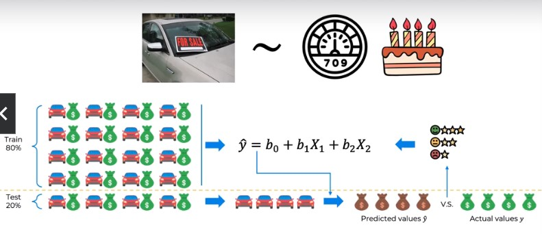
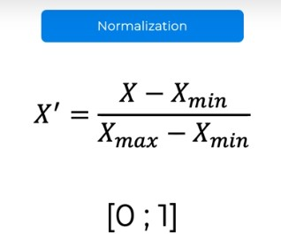
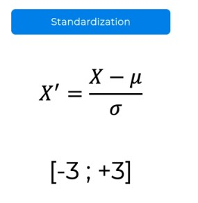

**The Machine Learning Process**

There are three main steps in machine learning process
1. **Data Pre-Processing :**
   In this step, we
   - Import the data
   - Clean the data
   - Split into training and test sets
   > *our data is already cleaned and well formatted*
  
2. **Modelling the Data :**
   In this step, we
   - Build the model
   - Train the model
   - Make predictions
   > *this is the fun part, where we will learn different models and practice the skill set there* 

3. **Evaluation Process**
   In this step, we
   - Calculate the performance metrics
   - Make a verdict
   > *In this we basically calculate the performance of the model and assess the verdict made by the model* 

**Splitting the data into Training sets and Test sets**
there is something called dependent variable and independent variables

Researchers often manipulate or measure independent and dependent variables in studies to test cause-and-effect relationships.
- **independent variable** is the cause. its value is independent of other variables in your study
- **dependent variable** is the effect. its value depends on change in the independent variable.

We basically see change or affect happened in independent variable for any cause of change in dependent variables

**_Preparing the data :_**
From whole set of data, we basically divide into 80% as training set and 20% as test set.

**_Modelling the data :_**
We design the model from the training set and use the test set data to predict the values. 

**_Evaluation :_**
Since we already have values, we can compare the data and evaluate the performance and metrics of the designed model.

**Feature Scaling :**
> Feature scaling is a data processing technique that transforms the value of independent variables in a data set to a common scale. This is done to ensure that all features contribute equally to a model, and to improve the model's performance

feature scaling is applied to the columns of data and not across the columns (i.e., rows of data)

There are multiple types of feature scaling techniques, but we are looking at two types,

1. **Normalization :**
   

   Xmin is the minimum value of the column values.
   Xmax is the maximum value of the column values.
   X' is the scale value
   X is the value of the column

   
   Normalization feature scaling helps you to scale values between `[0 ; 1]`. The formulae above is used to calculate the normalized value for each given value of data

   

2. **Standardization :**
   

   Standardization will scale the values between `[-3; +3]`. any other outlier values will fall external to the bounds.

   Here, we use mean and standard deviation of values to calculate the respective value for a given column value.