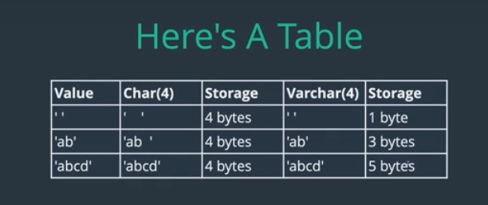

## Data Types in SQL

data types in SQL are simiar to data types in every other programming languages. 
> Data Types provide information about the type of value the the variable can hold to the compiler

But in context of SQL, it specifies the type of column in the table schema.

**CHAR :**
what is `CHAR` and how is it different from `VARCHAR`.

`VARCHAR` is optimized to store string of different sizes in best possible way.

on the other hand `CHAR`, is mainly used to store text of fixed sizes. like country codes (IN, PK, BN), which are usually have fixed number of characters.

`CHAR` basically has fixed size, So when we try to store a text to column of type `CHAR(n)`, database will try to save text of the given size.

Database will try to pad extra spaces at the end of the text, if the provided input text will not fit into the size

> The length of a CHAR column is fixed to the length that you declare when you create the table. The length can be any value from 0 to 255. When CHAR values are stored, they are right-padded with spaces to the specified length. When CHAR values are retrieved, trailing spaces are removed unless the `PAD_CHAR_TO_FULL_LENGTH` SQL mode is enabled.

Below table will explain it more better. with CHAR and VARCHAR compared to the schema definition, Value provided and actual bytes stored in memory.

Where we might prefer using `CHAR` over `VARCHAR`

- `CHAR` is faster for fixed length text (eg., State Abbrevations, Yes/No Flags(Y/N), Zip Codes)